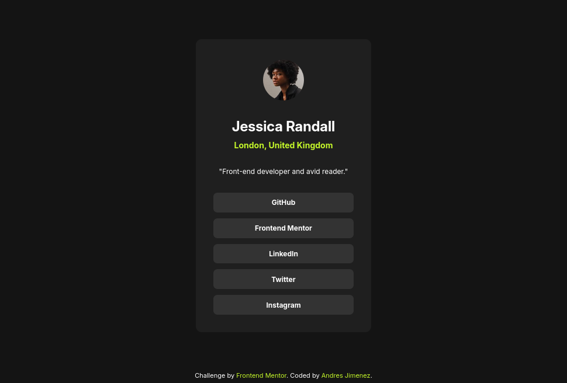

# Frontend Mentor - Social links profile solution

This is a solution to the [Social links profile challenge on Frontend Mentor](https://www.frontendmentor.io/challenges/social-links-profile-UG32l9m6dQ). Frontend Mentor challenges help you improve your coding skills by building realistic projects. 

## Table of contents

- [Overview](#overview)
  - [The challenge](#the-challenge)
  - [Screenshot](#screenshot)
  - [Links](#links)
- [My process](#my-process)
  - [Built with](#built-with)
  - [What I learned](#what-i-learned)
  - [Continued development](#continued-development)
- [Author](#author)

## Overview

### The challenge

Users should be able to:

- See hover and focus states for all interactive elements on the page

### Screenshot

### Links

- Solution URL: [https://github.com/andresj24/social-link-profile-component](https://github.com/andresj24/social-link-profile-component)
- Live Site URL: [https://sociallinkprofileaj.netlify.app/](https://sociallinkprofileaj.netlify.app/)

## My process

### Built with

- Semantic HTML5 markup
- CSS custom properties
- Flexbox

### What I learned

In this challenge I was able to continue practicing the positioning of containers and elements, in this case I was able to improve the code, using fewer lines to obtain better positioning.

### Continued development

Soon I will work on challenges with responsive designs and CSS grid.

## Author

- Frontend Mentor - [@andresj24](https://www.frontendmentor.io/profile/andresj24)
- Twitter - [@AndresitoJ96](https://www.twitter.com/andresitoj96)

